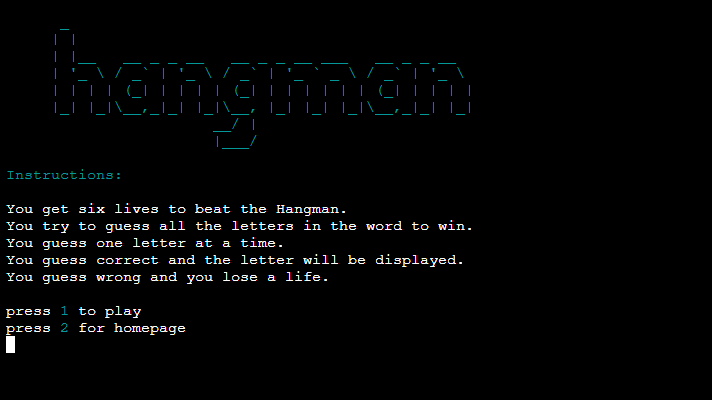

# The Hangman Word Game

This is a web application re-creating the word game Hangman. Players try to discover a word by guessing its letters. Each time a player guesses a correct letter it is revealed on screen. Each time a player guesses a wrong letter they lose a life. The web application is for anyone who would like to play a word puzzle game. The game is a console line web appliactaion built using Python.

[The Hangman Word Game](https://the-hangman-wordgame.herokuapp.com/)

)

# User Experience (UX)

The user experience is designed to be as user friendly and intuitive as possible. Clear instructions and feedback messages are provided to the user and some colour has been added to text. This adds to the user experience withn the constraints of a console line web application.

# Design

The Design process for the hangman game started with a flow chart to map out the steps involved through out life cycle of the game.

)

# Site Structure

The Hangman game runs as a python console line web application on the Heroku platform.

# Features

## Hangman banner
 - The Hangman banner is displayed at the top of the landing page. 
 - It is an ascii art design in cyan color and welcomes the user. 
 - It immediately conveys the name of the game and adds to the user experience.

## Instructions
 - The instructions give clear details explaining how to play the game.

## Game levels
 - An option for different game levels is provided to the user.
 - The user can press 1 for an easier level.
 - The user can press 2 for an harder level.

 

 ## Game page
 - The game page displays an ascii art feature reprenting the gallows.
 - This is where the image of a person will be drawn as the game progresses.
 - The number of lives is displayed in green under the gallows
 - The blanks/underscores displayed in cyan color represent the letters of the word.
 - The correct letters guessed will replace the blank underscores as the user guesses them.
 - The user is prompted to guess a letter providing input to the game.

 

 ## Feedback to the user
  - Feedback is provided when a user guesses a letter.
  - When a correct letter is guessed the letter is displayed in the list of blank underscores.
  - A message is also returned advising that the Letter is in the word
  - When an incorrect letter is guessed the ascii art image to starts to be drawn.
  - The number of lives displayed is updtaed with the remaining lives left.
  - A message is also returned in orange warning text advising that the Letter is not in the word.

 

 ## Game over

 - If the user runs out of lives before guessing all the correct letters the game is over.
 - A message is returned to the user advising they have no lives left.
 - "Game Over" is displayed in red text.

 

 

