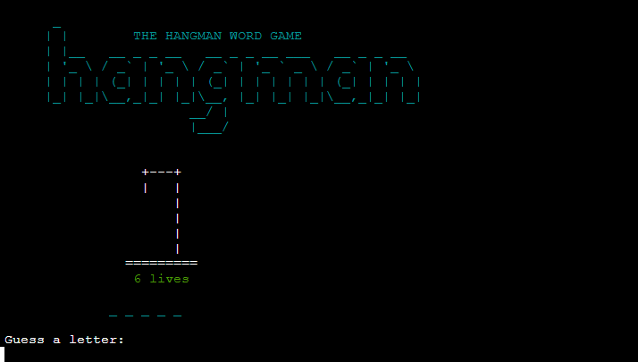
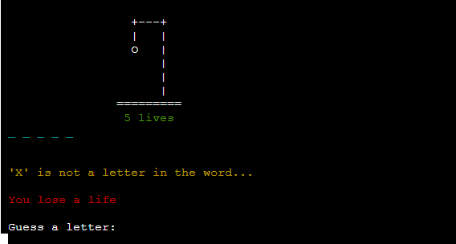

# The Hangman Word Game

## Overview

This is a web application re-creating the old word game Hangman. Players try to discover a word by guessing its letters. Each time a player guesses a correct letter it is displayed on screen. Each time a player guesses a wrong letter they lose a life. The web application is for anyone who would like to play a word puzzle game. The game is a python console line web appliactaion deployed on [Heroku](https://id.heroku.com/login).

Here is the link to the depleyd site [The Hangman Word Game](https://the-hangman-wordgame.herokuapp.com/)

# How to play
 - The player starts the game by selecting their option of an easier or harder level of the game.
 - A random word is generated but not revealed for the player to guess.
 - The word is presented on screen as a series of underscores "_ _ _ _ _" matching the number of letters in the word.
 - The player is prompted and enters their letter guess into the the terminal.
 - Invalid input returns a feedback message to the player.
 - A correct guess will result in the letter being displayed in its position in the list of underscores "_ O _ _ _".
 - An incorrect guess will result in losing a life and an ascii art image begins to draw the hangman.
 - The player begins each game with six lives. When all lives are gone the player loses the game.
 - If the player guesses all the letters in the word the player wins the game.

# Planning Phase

## User Stories:
As a user:
 - I want to know at first visit what the site is.
 - I want instructions on how to play the game.
 - I want feedback throughout the game.
 - I want to play the hangman word game

 ## Applications goals
The application aims to:
  - Make clear what the application is.
  - Provide instructions to play the game.
  - Provide feedback to players throughout the game.
  - Provide game functionality and enjoyable user experince to play the hangman word game.

## Achieving Application goals
 - Provide an ascii art banner for the application with welcome message.
 - Provide clear instructions to the user.
 - Provide return messages for invalid input, correct guesses, incorrect guesses, number of lives.
 - Design & Test the game functionality.
 - Display ascii art of person hanging as players lives are lost.

[Back to top](#Overview)

# Design

The Design process for the hangman game started with a flow chart to map out the steps involved through out life cycle of the game.
The flow chart was created using [Lucid Charts](https://www.lucidchart.com/pages/).

# User Experience 

The user experience is designed to be as user friendly and intuitive as possible. Clear instructions and feedback messages are provided to the user and some colour has been added to text. This adds to the user experience withn the constraints of a console line web application.

# Site Structure

The Hangman game runs as a python console line web application hosted on the Heroku cloud application platform.

[Back to top](#Overview)

# Features

## Hangman banner
 - The Hangman banner is displayed at the top of the landing page. 
 - It is an ascii art design in cyan color and welcomes the user. 
 - It immediately lets the user know what the site is and adds to the user experience.

## Landing page menu
- A welcome message is displayed to the user.
- A menu introduces the user to the navigation system of the site.
- The user can choose to play the game or go to the instructions page.

## Instructions
 - The instructions give clear details explaining how to play the game.
 - The user can then easily choose to play the game or return to the homepage.

## Game levels
 - When the user chooses to play an option for different game levels is provided.
 - The user can press 1 for an easier level.
 - The user can press 2 for an harder level.

 

 ## Game page
 - The game page displays an ascii art feature reprenting the gallows.
 - This is where the image of a person will be drawn as the game progresses.
 - The number of lives is displayed in green under the gallows
 - The blanks/underscores displayed in cyan color represent the letters of the word.
 - The correct letters guessed will replace the blank underscores as the user guesses them.
 - The user is prompted to guess a letter providing input to the game.

 

 ## Feedback to the user
  - Feedback is provided when a user inputs a guess.
  - When a correct letter is guessed the letter is displayed in the list of blank underscores.
  - A message is also returned advising that the Letter is in the word
  
 

  - When an incorrect letter is guessed the ascii art image to starts to be drawn.
  - The number of lives displayed is updated with the remaining lives left.
  - A message is also returned in orange warning text advising that the Letter is not in the word.
  - A message in red text advise that the user has lost a life.
  - This all combines to give an easy and intuitive user experience.
  - The different colors add to the user experience.

   

 ## Game over - lose

 - If the user runs out of lives before guessing all the correct letters the game is over.
 - A message is returned to the user advising they have no lives left.
 - "Game Over" is displayed in red text.
 - The user can then easily choose to play again or return to the homepage by selecting from the menu feature.

 

  ## Game over - win
  - If the user guesses all the letters in the word they win.
  - A message is returned to the user advising they have won.
  - "YOU WIN" is displayed in green text
  - The user can then easily choose to play again or return to the homepage by selecting from the menu feature.

 

[Back to top](#Overview)

# Technologies used
  - [Python](https://www.python.org/) was used to code the application.
  - [pep8 validator](http://pep8online.com/) was used to validate the python3 code.
  - [Gitpod](https://www.gitpod.io/#get-started) was used to create and edit the applications files.
  - [Github](https://github.com/) was used to host the code repository.
  - [Heroku](https://id.heroku.com/login) was used to deploy the application.

# Testing

## Bugs

# Deployment
The Hangman web application was deployed using the [Heroku](https://id.heroku.com/login) platform.

The following steps were taken to deploy the site:

 - Log into your Heroku account.
 - From the home dashboard, click on "New" then "Create new app".
 - Enter the "App name" and "Choose a region" before clicking on "Create app".
 - Go to "Config Vars" under the "Settings" tab.
 - Click on "Reveals Config Vars" and add the KEY: CREDS and the VALUE stored in creds.json file if needed.
 - Add the Config Var, KEY: PORT and VALUE: 8000.
 - Go to "Buildpacks" section and click "Add buildpack".
 - Select "python" and click "Save changes"
 - Add "nodejs" buildpack as well using the same process.
 - Go to "Deployment method", under the "Deploy" tab select "GitHub" and click on "Connect to GitHub".
 - Go to "Connect to GitHub" section and "Search" the repository to be deployed.
 - Click "Connect" next the repository name.
- Choose "Automatic deploys" or "Manual deploys" to deploy your application.

# credits

## Content
 - The Hangman banner ascii art came from [ascii.co.uk](https://ascii.co.uk/)
 - The Hangman ascii images came from [Chris Horton](https://gist.github.com/chrishorton/2624db0a0e82102bef769deb46971a47) github.
 - The colors used in the application came from [Colorama](https://pypi.org/project/colorama/)
 - The wordlists came from [hangmanwords](https://www.hangmanwords.com/words) and [randon word generator](https://www.randomlists.com/random-words)

## Acknowledgements

The Hangman wordgame was built as my Portfolio 3 Project for the Full Stack Software Developer (e-Commerce) Diploma at the [Code Institute](https://codeinstitute.net/ie/). I would like to thank my cohort facilitator [Kasia Bogucka](https://github.com/bezebee), my mentor [Precious Leige](https://www.linkedin.com/in/precious-ijege-908a00168/), the Code institue Slack community and the Code institute taem for the help and support provided to me throughout this project. 

