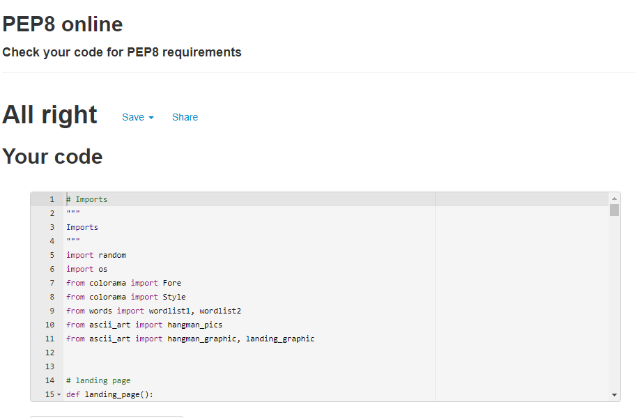

# TESTING
 - Python code validation was checked.
 - Game functionality was tested to ensure the gameworked as expected.
 - Navigation menus were tested to ensure they worked as expected.
 - User input was tested to ensure it was valid input.
 - User feedback messages were tested to ensure correct messages were returned to the user.

  ## Python Validation

  - PEP8 online validator was used to check python code was valid.
  - Warnings relating to line length, spaces between lines and trailing whitespace were displayed.
  - Once these warnings were addressed the code passed the pep8 validation check.

  

[Back to top](#TESTING)

## Game functionality

## Navigation

## User input

## User feedback

# Bugs

## Resolved

## Unresolved