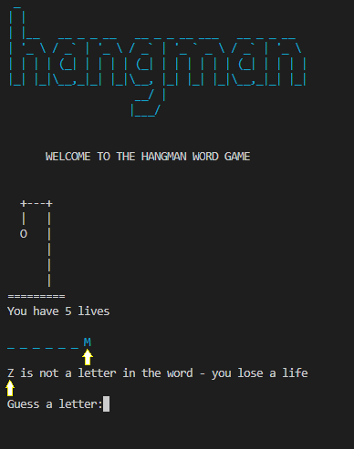

# TESTING
 - Python code validation was checked.
 - Game functionality was tested to ensure the gameworked as expected.
 - Menu validation and functionality was tested to ensure they worked as expected.
 - User input was tested to ensure it was valid input.
 - User feedback messages were tested to ensure correct messages were returned to the user.

  ## Python Validation

  - PEP8 online validator was used to check python code was valid.
  - Warnings relating to line length, spaces between lines and trailing whitespace were displayed.
  - Once these warnings were addressed the code passed the pep8 validation check.

  

[Back to top](#TESTING)

## Game functionality

 - The game was tested through development to ensure features worked as they were introduced.
 - The games features work as expected eg random word is generated and displayed correctly, letters display correctly, lives deduct accordingly, player wins or player loses all work as expected.
 - The game was tested by friends and family.
 - The game checked by peer code review. 

## Game input validation
 - User input validataion has been applied in the application.
 - Input validation was tested and works as expected.
 
 - eg user enters a charcter that is not a letter then feedback message is returned.
 

- eg user enters more than one charcter then feedback message is returned.
 

## Menu input validation

 - The menus on the landing page, instructions page, start play page, game over page all work as expected.
 - Input validation checks have been applied to the menus.
 - Feedback messages are returned to the user if they enter invalid input.
 - This ensures easy and intuitive navigation for the user with conistent styling.

   - Landing page menu validation:

 
  
   - Instructions page menu validation:

 
 
  - Start Play menu validation:

 
 
   - Game over menu validation:

 
 

# Bugs

## Resolved:
### PEP8
 - PEP8 warnings were encountered during the development process. 
 - These were minor issues and addressed accordingly. 
 - See python code validation section.

### Deployment

- When the application was deployed on the Heroku platform an error message occurred:
'ModuleNotFoundError: No module named 'colorama' 
- This was error was researched and the solution was found on slack.
- Manually adding colorama to the requirements.txt file resolved the issue.

### Code
- A bug was encountered when coding the deduction of lives section of the game.
- If an incorrect letter was guessed the last letter of the word would also be populated and diplayed.

 

 - The code was revisited and the issue was found with the sequence of the new lines of code.
 - Displaying the word to the terminal was incorrectly taking the value of the last iteration of the loop that checks if a letter is in the word.
 - The sequence of the code was adjusted to display the correct list of letters to the terminal. 

### Code Structure
- The control flow of the program had to be reworked when implementing the menu options into the application.
- Initially coding in the menu options caused issues.
- The the code was revisited and bettter structure was put in place by making better use of functions.
- A start function was added to allow better control flow.
- This resulted in successful implemention of the menu/navigation throughout the site.
- The code can run between the functions: start, landing page, instructions, play. 

## Unresolved
- A bug was found when a word contains two of the same letter.
- if the users guess is a letter that is in the word twice then feedback message for 'you have already picked that letter is returned.'
- This bug has been trouble-shooted but is still outstanding.
- I have removed the feature from the live site and will contine to investigate.
- The feature will be added in a future release after my assesment period with Code Institue is complete.